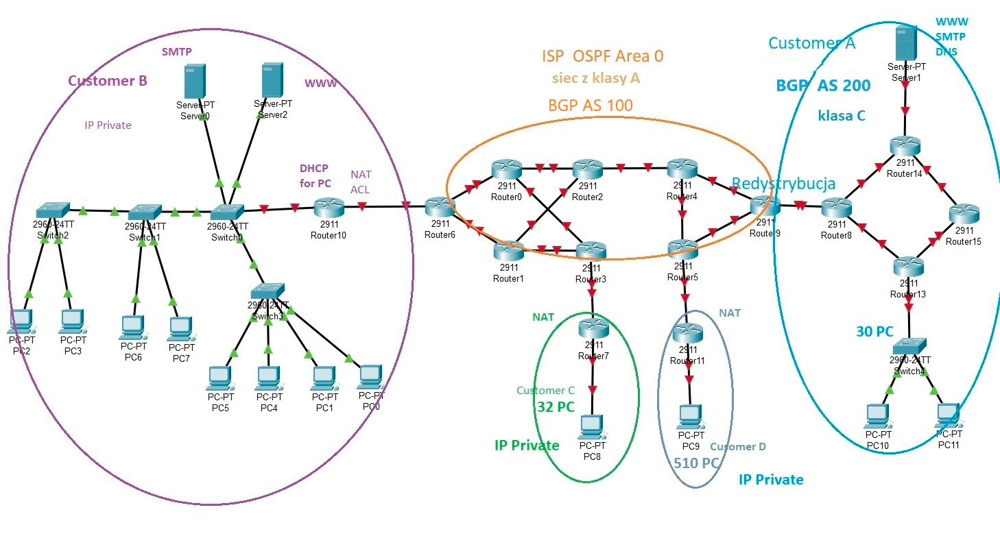

# ciscoLab
Osoby:
* Hubixo
* Remigiusz
* VladKoz
* wojexe

## Opis
Zadanie powinno byc zrobione w pakiet tracerze, plik znajduje sie w folderze.


 
 
## Rozwiazania
 #### Adresacja sieci IPv4 z najmniejszej liczby adresow IP 10 [VladKoz] ✅
Adresacja sieci z najmniejsza liczba adresow:  przerabiamy algorytm z cwiczen, czyli bierzemy ilosc urzadzen+2 po czym liczymy minimalna potege dwojki i z tego dostajemy maske.
```
Siec Customer A:
    3 urzadzenia. 
    1.0.0.0 - siec. Maska 255.255.255.248 = /29

Siec Customer B:
    10 urzadzen. 
    2.0.0.0 - siec. Maska 255.255.255.240 = /28

Siec Customer C:
    1 urzadzenie. 
    3.0.0.0 - siec. Maska 255.255.255.252 = /30

Siec Customer D:
    1 urzadzenie. 
    4.0.0.0 - siec. Maska 255.255.255.252 = /30
    
Ustawilem maske i ip kazdemu urzadzeniu w config. 
Tez zmienilem nazwe kazdego PC na odpowiadajacy sieci i ip. 

```
#### Routing z BGP 10 / bez BGP 5 [_Hubixo_]❌

#### VLAN'y 5 (minimum 4 vlany) [_Remigius_] ❌

#### Etherchannel 5 [_wojexe_] ❌

#### Redystrybucja 5 (z wersja BGP 10) [_Hubixo_] ❌

#### NAT 10 [_VladKoz_]❌

#### DHCP 10 [_wojexe_] ❌

#### Ekstra fiber links w ISP 2 [_Remigius_] ❌

#### ACL for WWW,SMTP 5 [_VladKoz_]❌

#### Mail serwer 3 [_Remigius_] ❌

### Komentarze od prowadzacego
 Dla ISP dobrac siec publiczna z klasy A dla Klienta A siec publiczna z  klasy C

 Dla klientów bez podanych sieci trzeba dobrać siec z puli adresów prywatnych.

 Strony WWW (onu klientow) maja być dostępne ze wszystkich PC  Dla Klienta B dobrać alokacje VLAN'ów. 
